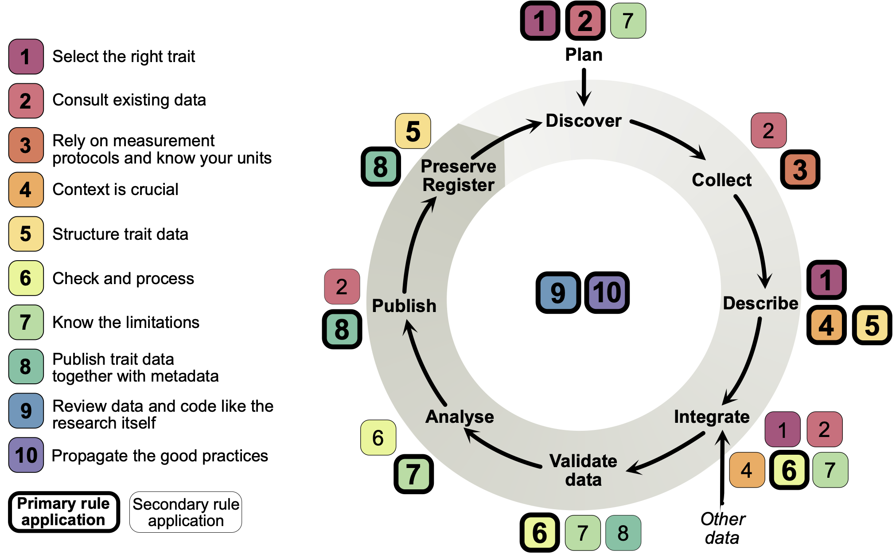

# A community driven resource for best practices
Based on the article, but open for public additions from the scientific community:

**"Ten (mostly) simple rules to future-proof trait data in ecological and evolutionary sciences"**

in Methods in Ecology and Evolution. [doi:10.1111/2041-210X.14033](https://doi.org/10.1111/2041-210X.14033)

## Abstract
Traits have become a crucial part of ecological and evolutionary sciences, helping researchers understand the function of an organism's morphology, physiology, growth and life-history, with effects on fitness, behaviour, interactions with the environment, and ecosystem processes. However, compiling and analysing trait data comes with data-scientific challenges due to the complex nature of trait data.
We offer best practices, with some detailed extensions, as a guide in making critical decisions that consider the entire life cycle of trait data. 
This article is particularly motivated by its last rule, i.e. to propagate the good practices, and has the intention of bringing awareness of the different facets of a trait's life cycle to the community. 
When it comes to working with trait data, we gain particularly as an interdisciplinary community of field biologists, synthesis ecologists, computer scientists and database managers. We hope these basic guidelines can be useful as a starter for active communication in disseminating such integrative knowledge and how to make trait data future-proof.

**We invite all fellow scientists to contribute and expand these seeds of Best Practices (Edit/Feedback on top of each page) and add additional ones (see README.md on Github) to make this a community-driven living, growing and evolving resource.** 

## Multilingual Abstracts: 

[German](best-practices/simple_abstract/german)

[Persian](best-practices/simple_abstract/persian)

## Table of contents (in progress)

[Motivation](best-practices/00_motivation)

1. [Select the right trait](best-practices/01_select-the-right-trait)
2. [Consult existing data](best-practices/02_consult-existing-data)
3. [Rely on measurement protocols and know your units](best-practices/03_rely-on-measurement-protocols-and-know-your-units)
4. [Context is crucial](best-practices/04_context-is-crucial)
5. [Structure trait data](best-practices/05_structure-trait-data)
6. [Check and process](best-practices/06_check-and-process)
7. [Know the limitations ](best-practices/07_know-the-limitations)
8. [Publish trait data together with metadata ](best-practices/08_publish-trait-data-together-with-metadata)
9. [Review data and code like the research itself](best-practices/09_review-data-and-code-like-the-research-itself)
10. [Propagate the good practices](best-practices/10_propagate-the-good-practices)

[References](best-practices/99_references)

*Best practices and where they apply in the overall trait data life cycle. Each topic is primarily applied to a specific element or the whole span of the cycle (in bold) but can also be necessary to other elements (secondary application).*

# Contributors
[Alexander Keller](members/alexander-keller), [Markus J. Ankenbrand](members/markus-j-ankenbrand), Helge Bruelheide, [Stefanie Dekeyzer](members/stefanie-dekeyzer), [Brian J. Enquist](members/brian-j-enquist), [Mohammad Bagher Erfanian](members/b-erfanian, [Daniel S. Falster](members/daniel-s-falster), [Rachael V. Gallagher](members/rachael-v-gallagher), [Jennifer Hammock](members/jennifer-hammock), [Jens Kattge](members/jens-kattge), Sara D. Leonhardt, [Joshua S. Madin](members/joshua-s-madin), [Brian Maitner](members/brian-s-maitner), [Margot Neyret](members/margot-neyret), Renske E. Onstein, [William D. Pearse](members/william-d-pearse), [Jorrit H. Poelen](members/jorrit-h-poelen), [Roberto Salguero-Gomez](members/roberto-salguero-gomez), [Florian D. Schneider](members/florian-d-schneider), Anikó B. Tóth, [Caterina Penone](members/caterina-penone)
